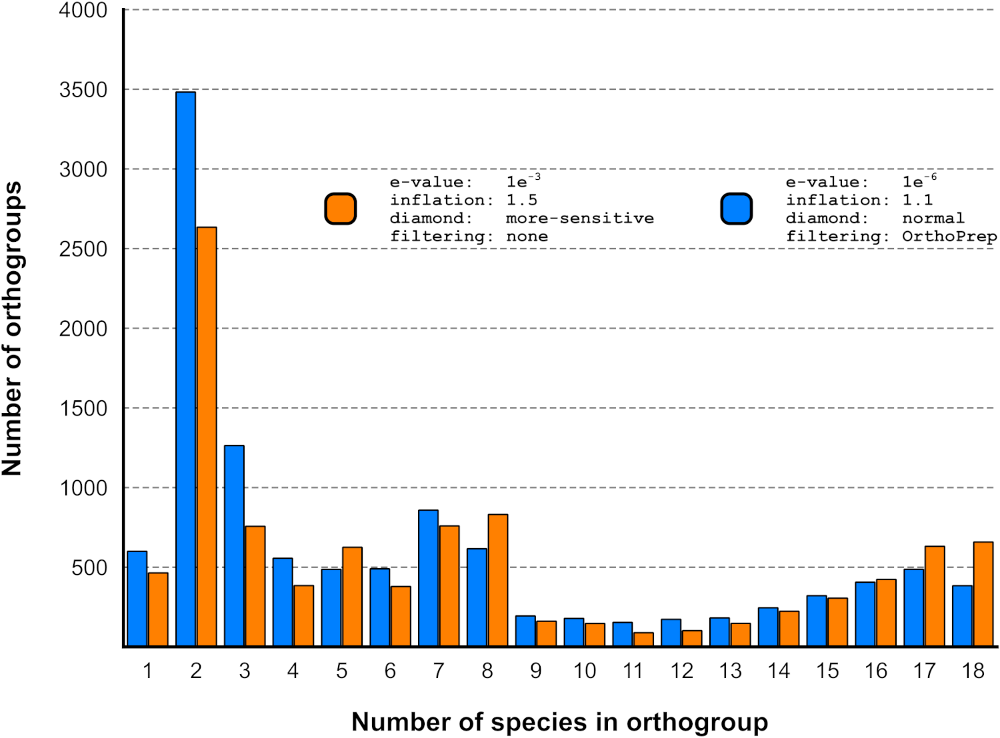
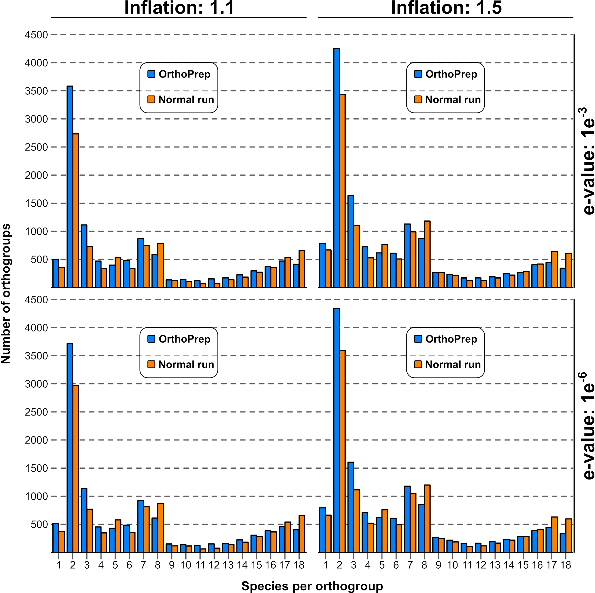

# OrthoPrep

## TL/DR

OrthoPrep can increase the sensitivity of OrthoFinder by decreasing the MCL inflation coefficient and removing spurious BLAST hits that come from comparing sequences of significantly different sizes, and/or that may contain low complexity regions (LCRs) that may result in false positive hits.

### Example run
Given a directory `/home/vflorelo/sequences` containing the following files:

- Plasmodium_falciparum_3D7.faa
- Plasmodium_reichenowi_CDC.faa
- Toxoplasma_gondii_ME49.faa
- Toxoplasma_gondii_RH88.faa

```
make_control_file.sh \
  --fasta_dir /home/vflorelo/sequences \
  --same_species 0.35 \
  --same_genus   0.40 \
  --diff_genus   0.45 \
  --decrement    0.05 > control_file.tsv

OrthoPrep.sh \
  --fasta_dir     /home/vflorelo/sequences \
  --masking       TRUE \
  --eff_len       TRUE \
  --search_method diamond \
  --blast_filter  TRUE \
  --control_file  control_file.tsv \
  --threads 16

orthofinder.py -b OrthoPrep-2024-08-01
```

## Dependencies

- [seg](https://ftp.ncbi.nlm.nih.gov/pub/seg/seg/)
- [fLPS2](https://biology.mcgill.ca/faculty/harrison/fLPS2programs.tar)
- [OrthoFinder](https://github.com/davidemms/OrthoFinder) and dependencies therein
- [bedTools](https://github.com/arq5x/bedtools2)
- [jq](https://jqlang.github.io/jq/)
- [GNU parallel](https://www.gnu.org/software/parallel/)
- 
## Implementation

OrthoPrep takes a directory containing fasta files with the proteomes of the organisms to be studied, it then calculates the effective length of each protein sequence by excluding low complexity regions. The hard-masked sequences are then subjected to all-versus-all comparisons using diamond but the reciprocal best hits are constrained by applying a size filter.

For any protein a length-interval is calculated, if the length-interval of the corresponding hit overlaps with that of the query, the pair is kept as a potential reciprocal best hit, if the intervals don't overlap, the pair is excluded.

Once the potential reciprocal best hits are determined, the sequences are reverted to remove the hard-masking and the OrthoFinder analysis can resume normaly.

The length intervals can be expressed as a fixed fraction of the protein length, or they can be adjusted based on specific comparisons:

|Species 1                |Species 2                |Size filter|
|:-----------------------:|:-----------------------:|:---------:|
|Toxoplasma gondii ME49   |Toxoplasma gondii RH88   |Strict     |
|Plasmodium falciparum 3D7|Plasmodium reichenowi CDC|Medium     |
|Plasmodium falciparum 3D7|Toxoplasma gondii RH88   |Relaxed    |

In the example above, proteins coming from the same species (but different strains) are not expected to vary too much in length, thus a strict filter (up to 35% of length tolerance) can be used to keep only meaningful reciprocal best hits. For proteins coming from the same genus but different species, a medium filter might be useful (up to 40% of length tolerance), and for species of different genera, a relaxed filter is recommended (up to 45% of length tolerance).

## Options

Given a directory `/home/vflorelo/sequences` containing the following files:

- Plasmodium_falciparum_3D7.faa
- Plasmodium_reichenowi_CDC.faa
- Toxoplasma_gondii_ME49.faa
- Toxoplasma_gondii_RH88.faa

The user can run orthoprep in several ways

### General preprocessing:

It is assumed that orthologous proteins can vary in size due to insertion/deletion events as well as contraction/expansion of repetitive elements.
Thus, if the proteomes of two closely related organisms are compared, it is not expected that their proteins vary too much in length if they indeed come from the same ancestor. However, if the organisms are more distantly related, their proteins might display more variance in size.

OrthoPrep requires a control file specifying the tolerance in protein length difference, this file can be prepared with the ancilliary script `make_control_file.sh`

```
make_control_file.sh \
  --fasta_dir /home/vflorelo/sequences \
  --same_species 0.35 \
  --same_genus   0.40 \
  --diff_genus   0.45 \
  --decrement    0.05 > control_file.tsv
```

The contents of the resulting tsv file will be:

|||||
|:---------------------------:|:---------------------------:|:--:|:--:|
|Plasmodium_falciparum_3D7.faa|Plasmodium_falciparum_3D7.faa|0.35|0.3 |
|Plasmodium_falciparum_3D7.faa|Plasmodium_reichenowi_CDC.faa|0.40|0.35|
|Plasmodium_falciparum_3D7.faa|Toxoplasma_gondii_ME49.faa   |0.45|0.4 |
|Plasmodium_falciparum_3D7.faa|Toxoplasma_gondii_RH88.faa   |0.45|0.4 |
|Plasmodium_reichenowi_CDC.faa|Plasmodium_reichenowi_CDC.faa|0.35|0.3 |
|Plasmodium_reichenowi_CDC.faa|Toxoplasma_gondii_ME49.faa   |0.45|0.4 |
|Plasmodium_reichenowi_CDC.faa|Toxoplasma_gondii_RH88.faa   |0.45|0.4 |
|Toxoplasma_gondii_ME49.faa   |Toxoplasma_gondii_ME49.faa   |0.35|0.3 |
|Toxoplasma_gondii_ME49.faa   |Toxoplasma_gondii_RH88.faa   |0.40|0.35|
|Toxoplasma_gondii_RH88.faa   |Toxoplasma_gondii_RH88.faa   |0.35|0.3 |


Indicating the accepted intervals for keeping potential RBHs when comparing the specified proteomes:
- When two proteomes of the same species are compared, the tolerance for length differences is at most 35% of the length of the compared proteins
- When two proteomes of the same genus but different species are compared, the tolerance for length differences is at most 40% of the length of the compared proteins
- When the compared proteomes come from different genera, the tolerance for length differences is at most 45% of the length of the compared proteins

The user can also specify a fixed tolerance for all comparisons, but that would be fairly unrealistic, specially when species of a broad phylogenetic span are included in the analysis. Once the control file is ready, the user can apply OrthoPrep to the sequences in the study.

### Full run mode:

In this mode, OrthoPrep masks the sequences by detecting LCRs with [seg](https://ftp.ncbi.nlm.nih.gov/pub/seg/seg/) and [fLPS2](https://biology.mcgill.ca/faculty/harrison/fLPS2programs.tar), then calculates the effective lengths based on the extent of LCRs.
BLAST hits are detected using diamond (or any valid option present in the OrthoFinder configuration) using the masked sequences.
Once the BLAST comparisons have finished, the hit table is filtered with the length constrains specified in `control_file.tsv`.

```
OrthoPrep.sh \
  --fasta_dir     /home/vflorelo/sequences \
  --masking       TRUE \
  --eff_len       TRUE \
  --search_method diamond \
  --blast_filter  TRUE \
  --control_file  control_file.tsv \
  --threads 16
```

### LCR masking but not filtering:

In this mode, the sequences are masked for LCRs, but no filter is applied to the RBH detection. This setting is useful to estimate the amount of noise introduced by LCRs.

```
OrthoPrep.sh \
  --fasta_dir     /home/vflorelo/sequences \
  --masking       TRUE \
  --eff_len       FALSE \
  --search_method diamond \
  --blast_filter  FALSE \
  --threads 16
```

### Size filtering without masking:

In this mode, the program calculates the effective length of each protein by detecting LCRs, however, the sequences remain unmasked for the RBH detection. Once the BLAST comparisons have finished, the hit table is filtered with the length constrains specified in `control_file.tsv`. This setting might be useful to detect orthologs in which the LCRs are actually a functional part of the proteins and they may truly reflect speciation events

```
OrthoPrep.sh \
  --fasta_dir     /home/vflorelo/sequences \
  --masking       FALSE \
  --eff_len       TRUE \
  --search_method diamond \
  --blast_filter  TRUE \
  --control_file  control_file.tsv \
  --threads 16
```

### Size filtering without detection of LCRs:

In this mode, the program does not detect LCRs, thus the size filtering is rather strict and might lead to overclustered orthogroups, might be useful to analyse strain from closely related species

```
OrthoPrep.sh \
  --fasta_dir     /home/vflorelo/sequences \
  --masking       FALSE \
  --eff_len       FALSE \
  --search_method diamond \
  --blast_filter  TRUE \
  --control_file  control_file.tsv \
  --threads 16
```

## Output

OrthoPrep produces a directory containing filtered diamond/BLAST tables that can be directly passed to OrthoFinder.

## Background

The detection of orthologs is always challenging and the results may vary depending on the employed software, the number and diversity of the organisms included in a given analysis. There are many available programs for orthology inference, and their performance, accuracy and recall are evaluated by the Quest for Orthologs (QfO) consortium.

From the current QfO assessment, OrthoFinder appears to be one of the most popular [ref](https://pubmed.ncbi.nlm.nih.gov/?linkname=pubmed_pubmed_citedin&from_uid=31727128) and accurate programs [ref](https://pubmed.ncbi.nlm.nih.gov/35552456/). While the default options for OrthoFinder work generally well for any set of organisms, the intrinsic properties of the studied proteins can often result in problematic orthology assessment

A general issue in homology detection is the presence of false matches resulting from unrelated proteins sharing repetitive regions or regions with very biased amino acid composition, the so-called Low Complexity Regions (LCRs). This issue has been addressed previously in softwares such as InParanoid [ref](https://pubmed.ncbi.nlm.nih.gov/19892828/), however, newer versions of InParanoid have removed the LCR filtering step due to significantly increased run times [ref](https://pubmed.ncbi.nlm.nih.gov/35561192/).

Due to the local alignments used by diamond or BLAST, it might be possible that two proteins are placed in the same orthogroup despite being of considerable different sizes. The difference in protein size can arise from fused genes, large insertions/deletions and/or expansion/contraction of LCRs and repetitive elements. It has been proposed that protein function can be influenced by protein size, thus, two proteins of significantly different sizes might not be likely to perform the same function.

In order to address the presence of LCRs, as well as the differences in protein length, and their potential effects on orthology inference, we developed OrthoPrep, an OrthoFinder preprocessor that limits the number of significant matches based on sequence composition and effective search space.

The full pipeline includes:
- Detection of LCRs using seg and fLPS2
- Adjustment of the proteins' effective length based on the presence of LCRs
- Masking of sequences before running diamond/BLAST
- Selecting only pairs of proteins of comparable size with a taxonomy-based tolerance

By default, OrthoFinder uses diamond with a permissive e-value (1e-3) and soft-masking of common motifs  with the `--more-sensitive` option. Genes belonging to the same orthogroup are connected by a network approach using MCL with an inflation coefficient of 1.5. 

To assess the effectiveness of our preprocessor, we ran OrthoFinder under several conditions:
- We tested two e-value thresholds (1e-3 and 1e-6)
- We evaluated two diamond settings for masking common motifs (with and without the `--more-sensitive` option)
- We applied the composition bias filter to the obtained BLAST hits
- We tried two different inflation coefficient values (1.5 and 1.1)

In the following table we include the number of genes found in the orthogroup containing PfEMP1, a well characterised gene in _Plasmodium falciparum_


|Test|e-value|diamond       |I.C.|OrthoPrep|B. bov|C. cio|C. par|C. cay|E. ten|H. tar|Hep|N. can|Nep|P. fal|P. gab|P. gal|P. kno|P. rei|P. viv|S. neu|T. ann|T. gon|Total|
|:--:|:-----:|:------------:|:--:|:-------:|:----:|:----:|:----:|:----:|:----:|:----:|:-:|:----:|:-:|:----:|:----:|:----:|:----:|:----:|:----:|:----:|:----:|:----:|:---:|
|  1 | 1e-3  |more_sensitive|1.5 |    ×    |  0   |  0   |  0   |  0   |  0   |  0   | 0 |  0   | 0 |  56  |  0   |  0   |  0   |  0   |  0   |  0   |  0   |  0   | 56  |
|  2 | 1e-3  |more_sensitive|1.5 |    ✓    |  0   |  0   |  0   |  0   |  0   |  0   | 0 |  0   | 0 |  47  |  0   |  0   |  0   |  1   |  0   |  0   |  0   |  0   | 48  |
|  3 | 1e-3  |more_sensitive|1.1 |    ×    |  1   |  1   |  0   |  4   |  5   |  6   | 9 |  5   | 4 |  80  |  114 |  12  |  11  |  107 |  20  |  5   |  1   |  6   | 391 |
|  4 | 1e-3  |more_sensitive|1.1 |    ✓    |  0   |  0   |  0   |  0   |  0   |  0   | 0 |  0   | 0 |  58  |  0   |  0   |  0   |  60  |  0   |  0   |  0   |  0   | 118 |
|  5 | 1e-3  |N/A           |1.5 |    ×    |  0   |  0   |  0   |  0   |  0   |  0   | 0 |  0   | 0 |  53  |  0   |  0   |  0   |  0   |  0   |  0   |  0   |  0   | 53  |
|  6 | 1e-3  |N/A           |1.5 |    ✓    |  0   |  0   |  0   |  0   |  0   |  0   | 0 |  0   | 0 |  47  |  0   |  0   |  0   |  0   |  0   |  0   |  0   |  0   | 47  |
|  7 | 1e-3  |N/A           |1.1 |    ×    |  0   |  0   |  0   |  1   |  1   |  1   | 4 |  1   | 2 |  72  |  104 |  1   |  4   |  99  |  3   |  1   |  0   |  1   | 295 |
|  8 | 1e-3  |N/A           |1.1 |    ✓    |  0   |  0   |  0   |  0   |  0   |  0   | 0 |  0   | 0 |  61  |  6   |  0   |  0   |  61  |  0   |  0   |  0   |  0   | 128 |
|  9 | 1e-6  |more_sensitive|1.5 |    ×    |  0   |  0   |  0   |  0   |  0   |  0   | 0 |  0   | 0 |  56  |  0   |  0   |  0   |  0   |  0   |  0   |  0   |  0   | 56  |
| 10 | 1e-6  |more_sensitive|1.5 |    ✓    |  0   |  0   |  0   |  0   |  0   |  0   | 0 |  0   | 0 |  47  |  0   |  0   |  0   |  1   |  0   |  0   |  0   |  0   | 48  |
| 11 | 1e-6  |more_sensitive|1.1 |    ×    |  1   |  1   |  0   |  4   |  5   |  6   | 9 |  5   | 4 |  75  |  107 |  3   |  6   |  102 |  5   |  6   |  1   |  6   | 346 |
| 12 | 1e-6  |more_sensitive|1.1 |    ✓    |  0   |  0   |  0   |  0   |  0   |  0   | 6 |  0   | 0 |  39  |  41  |  6   |  60  |  40  |  99  |  0   |  0   |  0   | 291 |
| 13 | 1e-6  |N/A           |1.5 |    ×    |  0   |  0   |  0   |  0   |  0   |  0   | 0 |  0   | 0 |  51  |  0   |  0   |  0   |  0   |  0   |  0   |  0   |  0   | 51  |
| 14 | 1e-6  |N/A           |1.5 |    ✓    |  0   |  0   |  0   |  0   |  0   |  0   | 0 |  0   | 0 |  46  |  0   |  0   |  0   |  0   |  0   |  0   |  0   |  0   | 46  |
| 15 | 1e-6  |N/A           |1.1 |    ×    |  0   |  0   |  0   |  1   |  1   |  1   | 3 |  1   | 2 |  72  |  102 |  1   |  4   |  99  |  3   |  1   |  0   |  1   | 292 |
| 16 | 1e-6  |N/A           |1.1 |    ✓    |  0   |  0   |  0   |  0   |  0   |  0   | 0 |  0   | 0 |  61  |  7   |  0   |  0   |  63  |  0   |  0   |  0   |  0   | 131 |

PfEMP1 is known to be present only in _Plasmodium_ species belonging to the Laverania group, _P. falciparum_ (~60 copies, [ref](https://pubmed.ncbi.nlm.nih.gov/20018734/)), _P. reichenowi_ (>50 copies, [ref](https://pubmed.ncbi.nlm.nih.gov/23725540/) ) and to a lesser extent in _P. gaboni_ ([ref](https://pubmed.ncbi.nlm.nih.gov/26456841/)). When we used the default settings, we were not able to capture the PfEMP1 orthologs in _P. reichenowi_ (1). By decreasing the inflation coefficient to 1.1 we were able to identify orthologs in _P. reichenowi_, however, by doing this without filtering the results, several false-positive matches were obtained (3,7,11,15), leading to the wrong conclusion that PfEMP1 has homologues in species outside of the Laverania group, and even outside of the _Plasmodium_ genus. However, when we apply a composition bias filter (4,8,12,16) we obtain cleaner results that are in line with previous findings about PfEMP1 ([ref](https://pubmed.ncbi.nlm.nih.gov/26456841/)). The e-value threshold did not impact significantly the distribution of PfEMP1, however, the `--more-sensitive` option  of diamond produced unexpected results, even when applying the composition bias filter (4 vs 8, 12 vs 16).

After using PfEMP1 as an initial benchmark of the OrthoPrep parameters, we then proceeded to assess the effectiveness of OrthoPrep by comparing the inferred orthogroups with those inferred using OrthoFinder without any filters applied to the sequences. The most evident effect was a significant increase in the number of orthogroups with only two species, and a slight decrease in the number of orthogroups containing all 18 species in the assessment. Interestingly, the number of orthogroups containing 3,4,6,7,9-15 species increased by running OrthoPrep on the sequences.
Since most of the resulting orthogroups 





